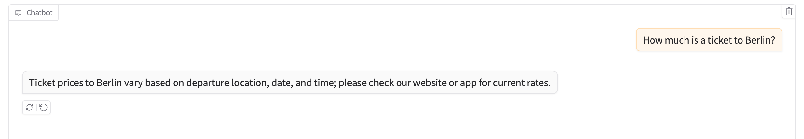
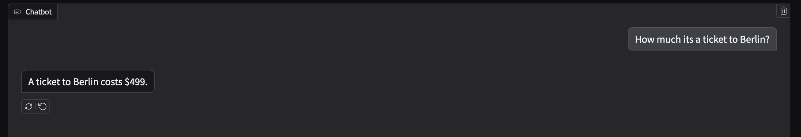

# Flight Assistant with Gradio
This project implements an interactive chatbot powered by OpenAI's GPT-4o-mini, a lightweight version of ChatGPT. Initially, the chatbot functions as a general assistant, responding to user queries. In the second phase, it is enhanced with tools, enabling it to fetch real-time flight prices—capabilities it previously lacked.

This project demonstrates:
- OpenAI Model Integration,leveraging OpenAI’s cloud-based AI model for real-time responses.
- Use of tools, so extends functionality by allowing the LLM to call external functions, such as retrieving flight prices.
- Load environment variables
- Send the history message in OpenAI format: Gradio already setup for us: 
[
    {"role": "system", "content": "system message here"},
    {"role": "user", "content": "first user prompt here"},
    {"role": "assistant", "content": "the assistant's response"},
    {"role": "user", "content": "the new user prompt"},
]
- Use Gradio as a chat interface with support for light and dark modes. Deploy it locally or generate a public URL, which remains valid for 72 hours. For free permanent hosting and GPU upgrades, run gradio deploy from the terminal in the working directory to deploy the application to Hugging Face Spaces.

With tool

**Model used**
gpt-4o-mini

**Benefits:**
1. The higest power the market offers as is a Frontier LLM model

**Disadvantages:**
1. API charges
2. Data leaves your box

## OpenAI Setup

1. Create an OpenAI account if you don't have one by visiting:
https://platform.openai.com/

2. OpenAI asks for a minimum credit to use the API. 

You can add your credit balance to OpenAI at Settings > Billing:  the minimun amounth for my country is $5
https://platform.openai.com/settings/organization/billing/overview

I recommend you disable the automatic recharge!

3. Create your API key

The webpage where you set up your OpenAI key is at https://platform.openai.com/api-keys - press the green 'Create new secret key' button and press 'Create secret key'. Keep a record of the API key somewhere private; you won't be able to retrieve it from the OpenAI screens in the future. It should start `sk-proj-`.

Other frontier models at:
- Claude API at https://console.anthropic.com/ from Anthropic
- Gemini API at https://ai.google.dev/gemini-api from Google

4. When you have these keys, please create a new file called `.env` in your project root directory. The filename needs to be exactly the four characters ".env" rather than "my-keys.env" or ".env.txt". Here's how to do it:
Type OPENAI_API_KEY=xxxx

